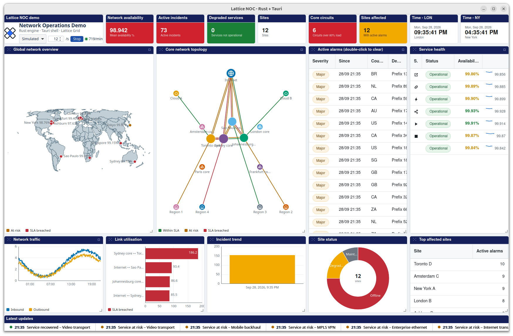

# Lattice NOC: a network operations wall on the desktop, in Rust + Tauri

A network operations centre wall as a desktop app. A Rust engine builds and
moves the network (sites, circuits, alarms, service health, traffic) and a
[Lattice Grid](https://latticegrid.dev) page draws it: KPI tiles, a world map,
a network topology, alarm and service grids, charts and a ticker, all fed by
one data router. The app runs on Linux, macOS and Windows through
[Tauri](https://tauri.app), and the page loads nothing from the network: the
grid ships inside the app bundle.

It is the [Network Operations Centre demo](https://latticegrid.dev/demos/network-operations-centre/)
from latticegrid.dev, with its data layer moved from browser JavaScript into Rust.



*The wall on Linux (GNOME), one minute into simulated mode, Lattice Grid 1.76.0.*

## Run it

```sh
npm install        # installs the Tauri CLI and Lattice Grid, then copies the grid into src/lattice/
npm run dev        # builds the Rust side and opens the window
npm run build      # release build plus installers under src-tauri/target/release/bundle
cd src-tauri && cargo test    # the engine's unit tests
```

On Linux `npm run build` produces a `.deb`, an `.rpm` and an `.AppImage`; on
macOS an `.app` and a `.dmg`; on Windows an `.msi` and an NSIS `.exe`. None of
them is signed.

The wall opens in **Live** mode. Pick **Recorded** or **Simulated** in the
title window to run without a network connection.

### Prerequisites

Every platform needs [Rust](https://rustup.rs) (stable, via rustup) and
[Node.js](https://nodejs.org) 22 or later. Then:

- **Linux** (Debian/Ubuntu names; other distributions have equivalents):
  ```sh
  sudo apt install libwebkit2gtk-4.1-dev libgtk-3-dev libsoup-3.0-dev \
      libjavascriptcoregtk-4.1-dev libayatana-appindicator3-dev librsvg2-dev \
      build-essential curl wget file libssl-dev libxdo-dev
  ```
- **macOS**: the Xcode command line tools (`xcode-select --install`).
- **Windows**: the Microsoft C++ Build Tools ("Desktop development with C++")
  and the WebView2 runtime, which Windows 10 (1803+) and 11 already carry.

The [Tauri prerequisites page](https://tauri.app/start/prerequisites/) has the
full list for each platform.

### Where the grid comes from

Lattice Grid is an ordinary npm dependency (`@toclocoinc/lattice-grid`, pinned
in `package.json`). `scripts/vendor-grid.mjs` copies the files the page loads
(the core bundle and stylesheet, and the layout, data-router, charts,
marker-map, world-shapes, KPI and alarms modules) from `node_modules` into
`src/lattice/`. It runs on `npm install`, `npm run dev` and `npm run build`.
`src/lattice/` is generated and not committed; to move to a newer grid, change
the version in `package.json` and run `npm install`.

## What is in it

```
noc-tauri/
├── src/                      the wall (plain HTML + JS, no build step)
│   ├── index.html            the layout, the grids, the charts, the KPI tiles
│   ├── noc-client.js         the data router, fed by Tauri events
│   └── lattice/              generated: Lattice Grid and the modules the wall uses
├── scripts/vendor-grid.mjs   copies the grid out of node_modules
└── src-tauri/                the Rust side
    ├── src/lib.rs            the Tauri commands and the feed thread
    ├── src/noc/mod.rs        the engine: sites, alarms, services, samples
    ├── src/noc/live.rs       the network: RIS Live socket, PeeringDB, IODA
    ├── src/noc/rows.rs       what one row of each kind carries
    ├── src/noc/seed.rs       the seeded generator (same draws as the browser demo)
    └── data/                 the recorded footprint, outages and BGP feed, compiled in
```

## How the two halves talk

The page creates one data router with one source, `rust`, and attaches every
viewer to its route before anything is loaded. Then:

1. `invoke('noc_snapshot', { mode, rate })` builds a fresh world in Rust and
   answers every row in it. The page hands that to `handle.load()`. In `live`
   the footprint is read from PeeringDB first; the recorded copy stands in if
   that cannot be had.
2. `invoke('noc_start')` opens the feed. In `live` a task on Tauri's async
   runtime opens the RIS Live websocket, subscribes to AS3257, and hands every
   message to the engine; another reads today's outage detections from IODA.
   In every mode a thread steps the engine every 250 ms and emits `noc:changes`, an array of `{ op: 'upsert'|'delete', row }`
   in exactly the shape `handle.apply()` takes. Once a second the wall turns
   (alarms age out, sites are re-stated, services re-graded, derived rows
   pushed) and `noc:status` carries the status line.
3. `invoke('noc_clear_alarm', { id })` is an operator clearing an alarm by
   hand: double-click a row in the alarm grid. The cleared row comes back on
   the next tick like any other change, so the grid, the trend, the KPI tiles
   and the top-affected list all move together.
4. `noc_stop` closes the feed; `noc_set_rate` changes its pace. Switching
   mode in the title window stops, rebuilds the world and reloads the source.

Every row reaches a viewer through the router, keyed by `kind` then `id`.
Nothing in the page shapes a row and nothing in Rust knows a grid exists.

## Modes

- **Live** (the default): the real RIPE RIS Live BGP feed for AS3257 over a
  websocket, the footprint from PeeringDB and the day's country-level outage
  detections from IODA, all read by Rust. If the socket cannot be opened after
  two attempts the wall falls back to the recording, and the status line says
  so. Each fallback keeps the mode `live` so the page's controls stay honest.
- **Recorded**: the browser demo's `snapshot` mode. Ten minutes of real RIPE
  RIS Live BGP updates whose AS path contains AS3257, replayed on a loop
  against 275 real PeeringDB facilities, plus the recorded IODA outage
  detections. Each replayed event is stamped with the moment it is replayed.
- **Simulated**: routing events invented against twelve invented sites.
  Nothing in this mode is real.

The engine itself (`noc/mod.rs`) takes no network; `noc/live.rs` is the only
file that does, and it only ever hands the engine what it read.

## Data credits

- **BGP updates:** [RIPE NCC RIS Live](https://ris-live.ripe.net/), the live
  feed and the recording in `src-tauri/data/ris-capture.json`.
- **Facilities:** [PeeringDB](https://www.peeringdb.com/), read live and
  recorded in `src-tauri/data/sites.json`.
- **Outage detections:** [IODA](https://ioda.inetintel.cc.gatech.edu/)
  (Internet Outage Detection and Analysis, Georgia Tech), read live and
  recorded in `src-tauri/data/outages.json`.

Simulated mode uses none of them: its sites, circuits and events are invented.

## Licence

The demo code in this repository (the page, the Rust engine and the scripts)
is MIT-licensed; see [LICENSE](LICENSE).

Lattice Grid itself is **not** covered by that licence. It is commercial
software, installed from npm under its own licence (the `LICENSE` file in
`node_modules/@toclocoinc/lattice-grid`, copied into `src/lattice/`). Without
a key it runs in full on `localhost`, which includes a Tauri app's own origin
(`tauri://localhost` on Linux and macOS, `http://tauri.localhost` on Windows),
so this demo shows no trial watermark. See
[latticegrid.dev](https://latticegrid.dev) for licences.
